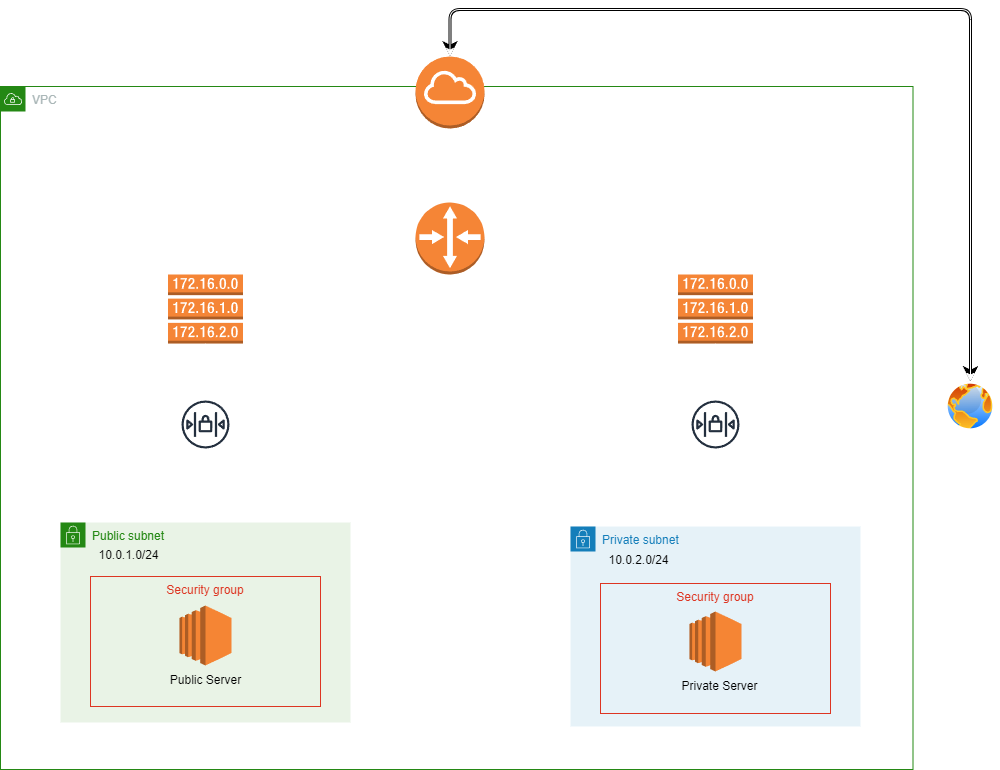

# AWS-VPC-NACL-Lab (WIP)




---

## Overview

This project allows you to quickly set up a Kubernetes cluster on AWS EKS using Terraform. It's designed to create resources in a modular, scalable way for testing and development purposes.

---

## Prerequisites

* Install **Terraform** and **Kubectl** on your var machine.
* Set up **AWS CLI** and configure your credentials:
  - Ensure you have `~/.aws/config` and `~/.aws/credentials` files set up properly.
  - You'll need an AWS account and an IAM user with sufficient permissions to create resources like EKS clusters, subnets, and VPCs.

---

# Cost Breakdown


# AWS VPC with Public and Private EC2 Instances

This project sets up an AWS Virtual Private Cloud (VPC) with both **public** and **private** EC2 instances. The public instance runs a basic Apache web server, while the private instance is designed to only be accessible from within the VPC, such as through ICMP (ping) from the public instance.

## Architecture Overview

This project provisions:
- **VPC** with public and private subnets
- **Public EC2 instance** with Apache HTTP server
- **Private EC2 instance** that can only be accessed from the public instance via ping
- **Custom NACLs and Security Groups** to control network traffic
- **IAM role** with `SSM` (AWS Systems Manager) access for managing EC2 instances without the need for SSH.

## Components

### VPC
- A custom **VPC** with:
  - Public and private subnets
  - Associated **route tables** and **internet gateway**

### EC2 Instances
- **Public EC2 instance**: Hosts an Apache web server accessible over HTTP (port 80) from the internet.
- **Private EC2 instance**: Accessible only within the VPC, allowing SSH and ICMP traffic from the public EC2 instance.

### Network ACLs
- **Public NACL**: Allows HTTP (port 80), SSH (port 22), and ICMP traffic.
- **Private NACL**: Restricts access to the private subnet, allowing only internal traffic from the VPC.

### Security Groups
- **Public Security Group**: Allows inbound HTTP and SSH traffic from the internet.
- **Private Security Group**: Allows inbound SSH and ICMP traffic from the public EC2 instance.

## Requirements

- **Terraform**: Ensure that Terraform is installed locally.
- **AWS Credentials**: Ensure your AWS CLI is configured with the appropriate credentials.

## Setup

1. **Clone the repository**:
    ```bash
    git clone <repository-url>
    cd <repository-directory>
    ```

2. **Configure variables**:
    - Update the `variables.tf` file to reflect your desired instance types, key pair name, and other customizable parameters.

3. **Initialize Terraform**:
    ```bash
    terraform init
    ```

4. **Apply the Terraform plan**:
    ```bash
    terraform apply
    ```
    This will provision the VPC, EC2 instances, and associated network resources.

## Usage

- After the setup is complete, the public EC2 instance will be accessible via its public IP address over HTTP.
- You can SSH into the **public instance** using:
    ```bash
    ssh -i <your-key>.pem ec2-user@<public-ip>
    ```
- From the public instance, you can ping the **private instance** using:
    ```bash
    ping <private-instance-ip>
    ```

## Troubleshooting

- If the web server is not accessible, ensure that:
  - The Apache service is running on the public instance:
    ```bash
    sudo systemctl status httpd
    ```
  - The public instance has a valid public IP and the security groups allow HTTP traffic.

- For issues with the private instance, verify that ICMP traffic is allowed in the security group and NACLs.

## Cleanup

To delete the resources created by Terraform, run:

```bash
terraform destroy
This will remove all provisioned infrastructure, including the VPC, EC2 instances, and network configurations.

Future Enhancements
Add autoscaling for the public instance.
Implement NAT Gateway for the private subnet to allow internet access for the private EC2 instance.
Use Amazon RDS in the private subnet for database hosting.
License
This project is licensed under the MIT License - see the LICENSE file for details.

Developed by Your Name

vbnet
Copy code

This `README.md` file includes essential information like project setup, architecture overview, usage, and troubleshooti